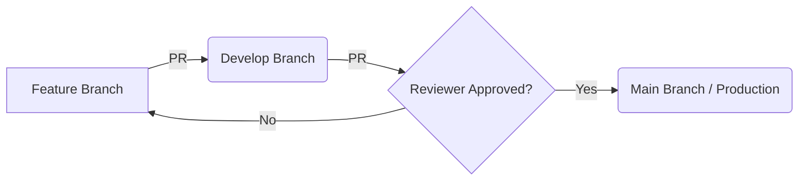

# 💻 PPLG Team - Official Organization

Selamat datang di **PPLG Team**, pusat kolaborasi dan manajemen proyek resmi Jurusan **Pengembangan Perangkat Lunak dan Gim (PPLG)**. Organisasi ini bukan sekadar tempat menyimpan kode, melainkan ekosistem untuk melatih standar industri, kolaborasi tim, dan manajemen siklus hidup perangkat lunak (SDLC).

---

## 📑 Daftar Isi

1. [Visi & Misi](https://www.google.com/search?q=%23-visi--misi)
2. [Arsitektur Organisasi](https://www.google.com/search?q=%23-arsitektur-organisasi)
3. [Standar Pengembangan (Dev Standard)](https://www.google.com/search?q=%23-standar-pengembangan-dev-standard)
4. [Alur Kerja (Git Workflow)](https://www.google.com/search?q=%23-alur-kerja-git-workflow)
5. [Manajemen Kualitas](https://www.google.com/search?q=%23-manajemen-kualitas)
6. [Dokumentasi & Portofolio](https://www.google.com/search?q=%23-dokumentasi--portofolio)
7. [Panduan Keamanan](https://www.google.com/search?q=%23-panduan-keamanan)
8. [Kepengurusan & Kontak](https://www.google.com/search?q=%23-kepengurusan--kontak)

---

## 🎯 Visi & Misi

### Visi

Menjadi pusat inkubasi talenta digital yang kompeten, disiplin, dan memiliki budaya kerja standar industri (Industry-Ready).

### Misi

* **Sentralisasi:** Memusatkan seluruh aset digital dan proyek siswa dalam satu platform terpadu.
* **Standardisasi:** Menerapkan standar penulisan kode, dokumentasi, dan manajemen proyek yang konsisten.
* **Kolaborasi:** Mendorong praktik *pair programming* dan *peer review* antar siswa.
* **Kontinuitas:** Memastikan warisan pengetahuan (*knowledge transfer*) tetap terjaga antar angkatan.

---

## 🏗️ Arsitektur Organisasi

Repository dikelola dengan skema penamaan yang ketat untuk memudahkan pencarian dan pengarsipan.

### 1. Klasifikasi Repository

| Nama Repo | Deskripsi |
| --- | --- |
| `final-project-[tahun]-[nama-proyek]` | Proyek Akhir Tahunan (Capstone Project). |
| `learning-lab-[topik]` | Materi pembelajaran, modul, dan latihan mandiri. |
| `templates` | Boilerplate untuk berbagai framework (Laravel, React, Unity, dll). |
| `ops-guidelines` | Dokumentasi aturan main organisasi (Standard Operating Procedure). |

### 2. Struktur Folder Proyek (Wajib)

Semua proyek di bawah naungan `pplg-team` wajib mengikuti struktur dasar:

```text
.
├── 📂 .github              # Konfigurasi GitHub (Issue template, CI/CD)
├── 📂 assets               # Aset desain, logo, dan gambar dokumentasi
├── 📂 docs                 # Dokumentasi teknis (ERD, API Doc, Manual)
├── 📂 src                  # Source code utama aplikasi
├── 📂 public               # Aset publik (jika web)
├── 📂 tests                # Unit testing dan integration testing
├── 📄 .env.example         # Template variabel lingkungan
├── 📄 .gitignore           # Daftar file yang diabaikan Git
├── 📄 README.md            # Dokumentasi utama proyek
└── 📄 CHANGELOG.md         # Catatan perubahan setiap versi

```

---

## 📘 Standar Pengembangan (Dev Standard)

### 1. Pesan Commit (Conventional Commits)

Kami mewajibkan format pesan commit agar riwayat proyek mudah dibaca:

* `feat:` Fitur baru.
* `fix:` Perbaikan bug.
* `docs:` Perubahan dokumentasi.
* `style:` Perubahan format (bukan logika).
* `refactor:` Restrukturisasi kode tanpa mengubah fungsi.
* `test:` Menambah atau memperbaiki testing.

**Contoh:** `feat(auth): implement google oauth login`

### 2. Tech Stack Utama

Meskipun bebas bereksplorasi, kami sangat menyarankan penggunaan:

* **Web:** Laravel, React, Next.js, Tailwind CSS.
* **Mobile:** Flutter, React Native.
* **Gim:** Unity (C#), Godot.
* **Database:** PostgreSQL, MySQL, MongoDB.
* **Tools:** Docker, GitHub Actions, Postman.

---

## 🔄 Alur Kerja (Git Workflow)

Kami menerapkan **Git Flow** yang dimodifikasi untuk memastikan kestabilan kode di branch utama.



### Aturan Pull Request (PR):

1. PR harus memiliki deskripsi yang jelas mengenai apa yang ditambahkan/diperbaiki.
2. Wajib melampirkan *screenshot* atau rekaman layar jika ada perubahan UI.
3. Minimal mendapatkan **1 Approve** dari Lead Developer atau Mentor.
4. Status CI/CD (jika ada) harus dalam keadaan **Passing**.

---

## 📊 Manajemen Proyek

Setiap tim wajib menggunakan fitur internal GitHub untuk transparansi kerja:

* **GitHub Issues:** Digunakan sebagai *backlog* pekerjaan atau laporan bug.
* **GitHub Projects (Kanban):** Memantau status tugas (To Do, In Progress, Review, Done).
* **Milestones:** Menentukan target jangka pendek (misal: Selesai Sprint 1 - Auth System).
* **Wiki:** Untuk dokumentasi teknis yang bersifat statis dan mendalam.

---

## 🧪 Standar Kualitas & Keamanan

### 1. Clean Code

* Gunakan penamaan variabel yang deskriptif (misal: `isUserLoggedIn` bukan `isLogin`).
* Terapkan prinsip **DRY (Don't Repeat Yourself)**.
* Fungsi/Method maksimal 20-30 baris untuk menjaga keterbacaan.

### 2. Keamanan Data

* **Dilarang Keras** melakukan commit pada file `.env` atau file berisi API Key.
* Gunakan repository bersifat **Private** jika sedang membangun proyek rahasia/komersial.
* Aktifkan **Dependabot** untuk memantau kerentanan pada library pihak ketiga.

---

## 👨‍💻 Struktur Kepengurusan

| Jabatan | Tanggung Jawab |
| --- | --- |
| **Project Owner** | Kepala Jurusan / Guru Produktif (Validasi akhir & Kebijakan). |
| **Maintainer** | Guru Pembimbing / Siswa Senior (Reviewer kode & Admin Repo). |
| **Lead Developer** | Ketua Tim Proyek (Manajemen tim & Arsitektur sistem). |
| **Contributors** | Seluruh Siswa PPLG (Eksekusi fitur & bug fixing). |

---

## 🚀 Prosedur Menjadi Kontributor

Siap untuk mulai berkontribusi? Ikuti langkah berikut:

1. **Minta Akses:** Hubungi Admin untuk ditambahkan ke tim organisasi.
2. **Fork/Clone:** Ambil repository proyek yang ditugaskan.
3. **Buat Branch:** `git checkout -b feature/nama-fitur-kamu`.
4. **Coding:** Terapkan standar kode yang telah ditentukan.
5. **Push & PR:** Push perubahanmu dan buat Pull Request ke branch `develop`.

---

## 📞 Kontak & Informasi

* **Website Sekolah:** smkn1karawang.sch.id
* **Forum Diskusi:** [GitHub Discussions]
* **Email Lab:** `pplg.smkn1karawang@gmail.com`
* **Instagram:** `@pplg.neskar`

---

> **"Great software is built by great teams, not just great coders."**
> **pplg-team** — Membangun masa depan digital, satu baris kode dalam satu waktu.
